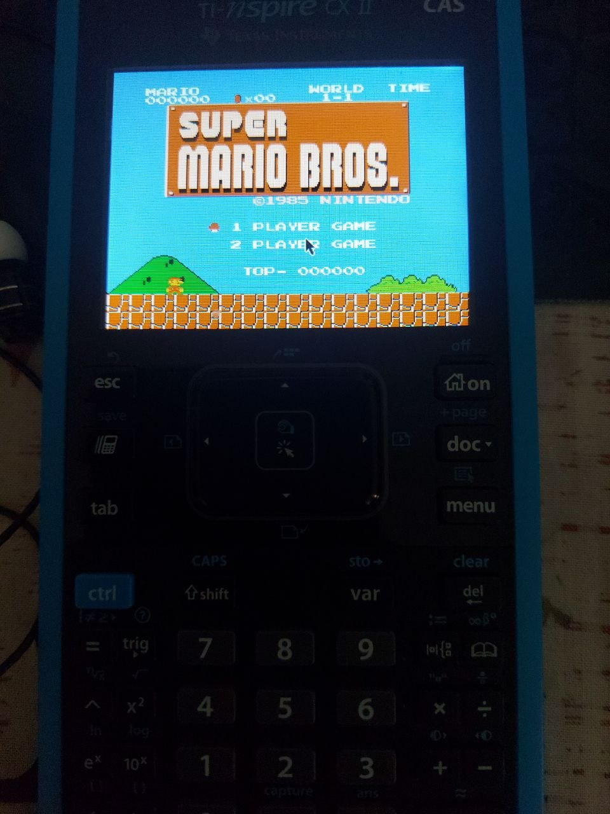

## NesNspire
> Now you can once again play Mario in physics class
<p align="center">

</p>
NesNspire is a port of InfoNES for the TI Nspire CX II graphing calculator. This project was conceived because the previously working port, Nespire, was written in Assembly and has been dead for a long time.


## Compiling
To compile, you'll need to setup the [Ndless SDK and Toolchain](https://www.hackspire.org/C_and_assembly_development_introduction/)

Fetch the latest code from github:
```
git clone https://github.com/mihkeymouse/nesnspire
cd nesnspire
```
Build the project
```
make
```
Copy the generated nesnspire.tns file over to your calculator, and place your ROMS in the same directory as the emulator. Enjoy!


##Downloading from Releases
Alternatively, head on over to [RELEASES]() and download the latest build.
Simply copy over nesnspire.tns to your calculator, and place your ROMS in the same directory as the emulator. Enjoy!

## Controls

| Calculator Key | NES Button |
|---|---|
| Arrow keys / 8/4/2/6 | D-Pad |
| Ctrl | A |
| Shift | B |
| Enter | Start |
| Esc | Select |
| Home / ON | Quit |

### Hotkeys
| Calculator Key | Action |
|---|---|
| Doc + 1 | Frameskip − |
| Doc + 3 | Frameskip + |
| Menu | Toggle screen edge clipping |

> [!CAUTION]
NesNspire is a free, open-source project and is not affiliated with, nor endorsed by, Nintendo. All trademarks are the property of their respective owners.
This software is provided "as-is." I cannot be held responsible for any copyright infringement committed by the end-user. It is the user's sole responsibility to ensure they have the legal right to use the ROM files they load into the software.

## Contributing
This project is still a work-in-progress, as such, expect bugs to popup from time to time. Feel free to contribute to this project by submitting a pull request!


## Credits
[Jay Kumogata](https://github.com/jay-kumogata/InfoNES) — original InfoNES emulator  
The [Ndless team](https://github.com/Ndless-Nspire) - for the fantastic jailbreak and SDK  
My aunt - for gifting me my Nspire.  
